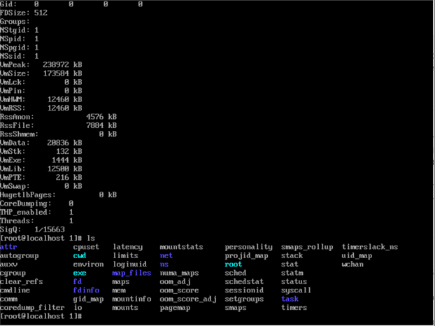

# CIT 352: Chapter 9

<!-- TODO -->
```
Samuel joshua
```

## Project 9-1

### Step 3

Which process has a Process ID of 1? (PID=1)

<!-- TODO -->
```
/user/lib/system/systemd
```

What character do most processes have in the terminal column (tty)

<!-- TODO -->
```
?
```

What does this character in the terminal column indicate?

<!-- TODO -->
```
Deamon process
```

## Project 9-2

### Step 8

Why did this command work when the others did not?

<!-- TODO -->
```
kill -PID forced the kill on bash
```

## Project 9-3

### Step 13

Insert the screen capture

<!-- TODO -->


## Project 9-4

### Step 3

Number of processes:

<!-- TODO -->
```
223
```

Number of sleeping processes:

<!-- TODO -->
```
219
```

Amount of total memory (K):

<!-- TODO -->
```
4037
```

Amount of total swap memory (K):

<!-- TODO -->
```
4170
```

## Project 9-5

### Step 15

When is the raid-check command run by the cron daemon?

<!-- TODO -->
```Sunday at 1am by default 0 1* * Sun   root
```

## Project 9-6

### Step 6

Insert the screen capture

<!-- TODO -->


## Command Reference

List all new commands you learned in this chapter.

<!-- TODO -->
```
ls /etc/cron.daily

cat meminfo | less

cat swaps

cat status | less

crontab -r

cd 1

cat /etc/cron.d/raid-check

ls /etc/cron.d


```

